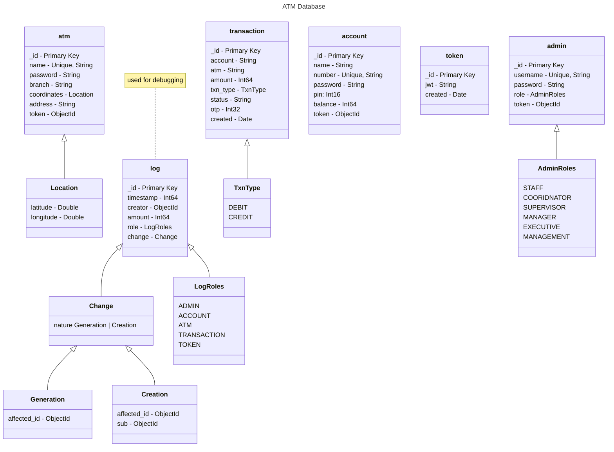
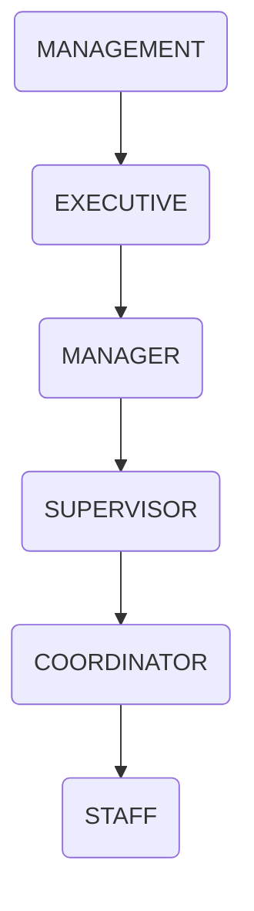

<h1 align="center">🤖 API Module for Touchless ATM</h1>

Rust Implementation of API module for touchless ATM UG Major Project. The API provides easy to use routes for database operations and abstracts away all the nitty gritty details from the API user. In accordance with the latest copyright policies released by Rust Foundation, I am compelled to say that this project is not affiliated with Rust or Rust Foundation in any way or form.

Before we get into the API routes lets us take a look at the database structure...

# Database Structure

I hope this was followed by anyone reading this, though it's not really important.

The database is tightly coupled with few indexes which are checked and created whenever server starts. These indexes add some semblance of logic to the otherwise non-coherent documents.

## Why choose NoSQL?
The answer to this question is quite simple really, because it offers flexibility otherwise not granted by RDBMS. The idea represented was in no need for relationships expressed by SQL's definitions, hence the selection of NoSQL for easier storage and retrieval.

# Tokens, Roles and Transactions
Tokens, Roles and Transaction play an important role and govern the behavior of API. Hence proper application is required for a successful request resolution.

## Transaction Types
- CREDIT
- DEBIT

## How to use token?
Token is provided after successful validation of any login route. This token is to be used as the value in the request headers with either `Authorization` or `Authentication` header key. 

The following format is followed: 

```ruby
Bearer <token>
```

If the prefix is missing the request will never proceed. The token length varies but will always be greater than 48 characters.

## Token Roles
Used for authentication and restriction of various routes.
- ADMIN
- ACCOUNT
- ATM


# Routes
The API offers multiple routes which can be divided into three major roles:

- [`admin`](#admin-routes)
- [`account`](#account-routes)
- [`atm`](#atm-routes)

## Admin Routes
Here are the following routes offered to admin users but before that here is the admin hierarchy.


This represents the hierarchy in decending order with management at the top. Hierarchy is involved only in creation of new entities, as of now. Though it is simpler to implement more methods that make use of this sequence. 

Here are the admin related routes:
- POST [`/admin/login`](#post-adminlogin)
- POST [`/admin/create`](#post-admincreate)
- POST [`/account/create`](#post-accountcreate)
- POST [`/atm/create`](#post-atmcreate)
- GET [`/get/account/<number>`](#get-getaccountnumber)
- GET [`/get/atm/<name>`](#get-getatmname)

## ATM Routes

An ATM is a stationary machine and it's details are required for any transaction to even take place, be it in AR Application or ATM itself. 

So, here are the following routes offered to ATM:
- POST [`/atm/login`](#post-atmlogin)
- POST [`/atm/txn/create`](#post-atmtxncreate)
- POST [`/atm/txn/confirm`](#post-atmtxnconfirm)
- GET [`/get/atm`](#get-getatm)
- GET [`/atm/txn/otp`](#get-atmtxnotp)

## Account Routes
An account refers to the actual account a user holds. Without the account number no transaction can take place. It's quite obvious but an account in this API comes with extra superpowers.

These routes are to be referred by the AR application:
- POST [`/account/login`](#post-accountlogin)
- POST [`/account/txn/create`](#post-accounttxncreate)
- POST [`/account/txn/confirm`](#post-accounttxnconfirm)
- GET [`/get/account`](#get-getaccount)
- GET [`/account/txn/otp`](#get-accounttxnotp)

## Route Information
Route navigation information is shown here for every route. It is important to understand the request parameters and requirements as without them the requests will not succeed.

### POST `/admin/login`

> No Role Restriction

> Token Not Required

<details>
<summary>Requirements</summary>

`Expects Json Object with following fields`
```js
{
  "username": "string" // 8 character long
  "password": "string"
  "role": "string" // One from hierarchy
}
```

If successfully validated returns a token to be attached for any of the below requests.

</details>

### POST `/account/login`
> No Role Restriction

> Token Not Required

<details>
<summary>Requirements</summary>

`Expects Json Object with the following fields`
```js
{
  "number": "string", // Account Number assigned to the user
  "password": "string"
}
```
The token generated after successful validation is required for the routes below.

</details>

### POST `/atm/login`
> No Role Restriction

> Token Not Required

<details>
<summary>Requirements</summary>

`Expects Json Object with following fields`
```js
{
  "name": "string",
  "branch": "string",
  "address": "string",
  "active": int64,
  "coordinates": {
      "latitude": float32,
      "longitude": float32
  },
  "password": "string"
}
```
The token generated after successful validation is required for the routes below.

</details>

### POST `/admin/create`
> Admin Only

> Token Required

<details>
<summary>Requirements</summary>

`Expects Json Object with following fields`
```js
{
  "username": "string" // 8 character long
  "password": "string"
  "role": "string" // One from hierarchy
}
```
Creates a new admin from the above if parameters are successfully validated. The role of hierarchy is important here as the recipient cannot create new admin accounts above their hiearchy. Every account creation is logged.

</details>

### POST `/account/create`
> Admin Only

> Token Required

<details>
<summary>Requirements</summary>

`Expects Json Object with following fields`
```js
{
  "name": "string" // 8 character long 
  "password": "string"
}
```

</details>

### POST `/atm/create`
> Admin Only

> Token Required

<details>
<summary>Requirements</summary>

`Expects Json Object with following fields`
```js
{
  "name": "string",
  "branch": "string",
  "address": "string",
  "active": int64,
  "coordinates": {
      "latitude": float32,
      "longitude": float32
  },
  "password": "string"
}
```
Only Supervisors or above and create new atms and access this route.

</details>

### POST `/atm/txn/create`
> ATM Only

> Token Required

<details>
<summary>Requirements</summary>

`Expects Json Object with following fields`
```js
{
  "account": "string", // Account Number of the User
  "amount": int64,
  "txn_type": "string" // Type of transaction CREDIT or DEBIT
}
```
The response includes an OTP, a security hazzard but is required to simplify the process. TO BE CHANGED LATER

</details>

### POST `/account/txn/create`
> Account Only

> Token Required

<details>
<summary>Requirements</summary>

`Expects Json Object with the following fields`
```js
{
  "atm": "string", // The name of the ATM
  "amount": int64,
  // For any account based transactions the type is defaulted to DEBIT, regardless whether the parameter is specified or not
}
```
The response includes an OTP, a security hazzard but is required to simplify the process. TO BE CHANGED LATER

</details>

### GET `/get/account/<number>`
> Admin Only

> Token Required

<details>
<summary>Requirements</summary>

`Expects the name of the atm in the url`

</details>

### GET `/get/atm/<name>`
> Admin Only

> Token Required

<details>
<summary>Requirements</summary>

`Expects the name of the atm in the url`

</details>

### GET `/get/account`
> Account Only

> Token Required

<details>
<summary>Requirements</summary>

`Expects no body but token in the Authorization header`

</details>

### GET `/get/atm`
> ATM Only

> Token Required

<details>
<summary>Requirements</summary>

`Expects no body but token in Authorization header`

</details>

### POST `/account/txn/confirm/<pin>`
> Account Only

> Token Required

<details>
<summary>Requirements</summary>

`Expects Json Object with the following fields along with pin number of the account in the request URL`
```js
{
  "otp": int16
}
```
A transaction is marked with complete after few checks.

</details>

### POST `/atm/txn/confirm/<pin>`
> ATM Only

> Token Required

<details>
<summary>Requirements</summary>

`Expects Json Object with the following fields along with pin number of the account in the request URL`
```js
{
  "otp": int16
}
```
A transaction is marked complete after few checks if the transaction type is DEBIT, otherwise no checks are performed.

</details>

### GET `/account/txn/otp`
> Account Only

> Token Required

<details>
<summary>Requirements</summary>

`Expects no body but token in the Authorization header`

If there are any pending transactions then otp is sent in the reponse. **Not a secure method** but currently used as a workaround over message based OTP sharing.

</details>

### GET `/atm/txn/otp`
> ATM Only

> Token Required

<details>
<summary>Requirements</summary>

`Expects no body but token in the Authorization header`

If there are any pending transactions then otp is sent in the reponse. **Not a secure method** but currently used as a workaround over message based OTP sharing.

</details>

### GET `/atm/txn/recent/value`
> ATM Only

> Token Required

<details>
<summary>Requirements</summary>

`Expects no body but token in the Authorization header`

**Not a secure method** Gets the amount of recent transaction made.

</details>

### GET `/atm/txn/status/reject`
> ATM Only

> Token Required

<details>
<summary>Requirements</summary>

`Expects no body but token in the Authorization header`

Rejects all the pending transactions of the requesting atm.

</details>

[comment]: <> (# Cryptography added later)

# Dependencies
The project is dependent on the following crates.

```toml
bcrypt = "0.14.0"
chrono = "0.4.23"
dotenv = "0.15.0"
jsonwebtoken = "8.2.0"
mongodb = "2.4.0"
rand = "0.8.5"
ring = "0.16.20"
rocket = "0.5.0-rc.2"
serde = "1.0.154"
```

For more details check [Cargo.toml](/Cargo.toml)

